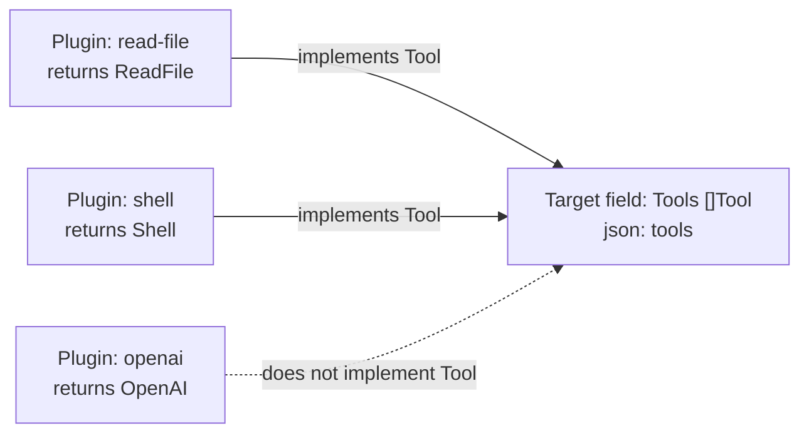
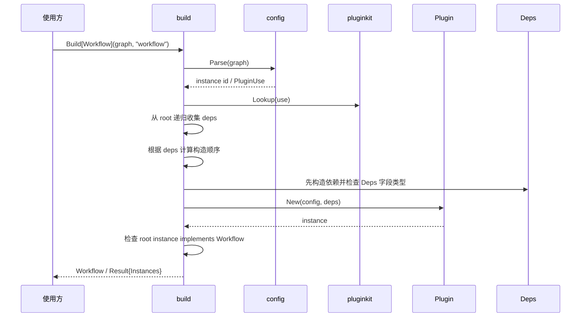
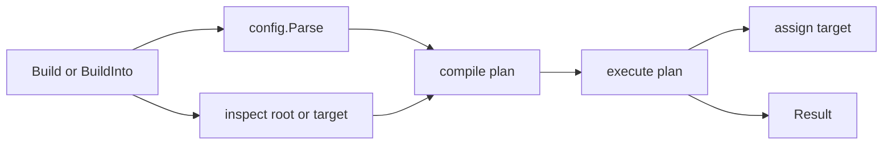
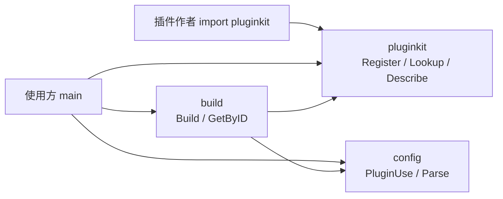

# 通用极简插件模块设计

**日期：** 2026-08-20  
**状态：** 草案  
**目标：** 解释清楚什么是插件、什么是扩展点、插件如何实现、插件如何按配置装配，并让这套机制可用于 Agent、workflow、ETL、CLI、server 等 Go 项目。

## 1. 核心结论

极简的模型是：

> 一切可装配能力都是插件实例；启动配置是一张从 root 出发的实例图，插件的 `Deps` struct 字段定义它需要的子扩展点。

因此：

- `init()` 只注册插件类型，也就是 `kind` 和构造函数。
- 插件不声明自己属于哪个扩展点。
- 使用方通常定义一个 root 插件，例如 `workflow`、`agent`、`etl`。
- root 插件通过 `Deps` 声明它依赖的子插件；子插件也可以继续声明自己的 `Deps`。
- 配置里的 `deps` 可以引用已有实例 id，也可以直接内联私有插件实例。
- `BuildInto` 仍可用于直接填充目标 struct，但它是辅助入口，不是默认主模型。

两条不变量：

1. `init()` 只做插件类型注册，不读取配置、不构造实例、不连接外部系统。
2. 依赖关系和实例化只发生在启动初始化阶段，由配置决定。

代码按这三条边界拆包，互不反向依赖：

| 包 | 路径 | 职责 |
|---|---|---|
| 插件类型 | `github.com/lengzhao/pluginkit` | `kind`、构造函数形态、`Register` / `Lookup` |
| 配置 | `github.com/lengzhao/pluginkit/config` | `PluginUse`、从通用配置树识别/规范化 |
| 实例化 | `github.com/lengzhao/pluginkit/build` | root 实例图、内联 deps 展开、`New`、接口检查、写入目标 struct |

这里的“动态”指启动期按配置选择和创建已经编译进二进制的插件实例，不指运行时加载未编译的 Go 代码。

## 2. 什么是插件

插件是一个可按配置构造出来的 Go 能力实现。

最小定义：

> 插件 = 一个通过 `kind` 命名、通过 `New(config, deps)` 构造、返回某个 Go 值的工厂。

插件只有两个核心身份：

| 字段 | 含义 |
|---|---|
| `kind` | 插件类型名，例如 `openai`、`read-file`、`http-step` |
| `constructor` | 构造函数，例如 `New(Config, Deps) (T, error)` |

这个 Go 值能不能用，取决于它是否满足使用位置的接口。

插件注册时不固定扩展点。一个插件如果同时实现多个接口，就可以被不同使用方放进不同位置。

## 3. 什么是扩展点

扩展点不是额外注册出来的对象，而是装配目标 struct 的字段。

Agent 示例：

```go
type AgentPlugins struct {
    LLM   agent.LLM    `json:"llm"`
    Tools []agent.Tool `json:"tools"`
}
```

Workflow 示例：

```go
type WorkflowPlugins struct {
    Store workflow.Store  `json:"store"`
    Steps []workflow.Step `json:"steps"`
}
```

字段表达三件事：

| 信息 | 来源 |
|---|---|
| 配置名 | `json` tag，例如 `json:"llm"` |
| 接口契约 | 字段类型，例如 `agent.LLM` |
| 单值/多值 | 字段是否为 slice |

装配目标 struct 本身就是扩展点定义。

## 4. 插件和扩展点的关系

插件和扩展点是使用时匹配，不是注册时绑定。



匹配规则：

- 字段类型是目标接口 `T`。
- 插件构造后的返回值 `V` 必须实现 `T`。
- 如果字段是 `[]T`，配置可以提供多个插件。
- 如果字段是 `T`，配置只能提供一个插件。
- 类型不匹配就是配置错误。
- 装配时先用注册得到的静态返回类型做预检查；如果静态返回类型已经不可能满足目标字段接口，则不调用该插件 `New`。
- 如果构造函数返回的是接口类型，静态类型可能过宽；这种情况在 `New` 返回实例后立刻做运行时类型检查。
- 插件依赖也按同样规则：被依赖实例必须先构造并满足 `Deps` 字段接口，然后才调用依赖方 `New`。

## 5. 注册模型

注册只登记插件类型和构造函数。

```go
func Register(kind string, constructor any)
```

示例：

```go
func init() {
    pluginkit.Register("read-file", New)
}

func New(cfg Config, deps Deps) (*ReadFile, error) {
    return &ReadFile{}, nil
}
```

`init()` 只能做这件事。它不能：

- 读取用户配置。
- 创建插件实例。
- 解析依赖关系。
- 连接数据库、模型、文件系统或网络。
- 启动 goroutine。
- 修改运行时状态。

注册时可以校验：

- `kind` 非空。
- `kind` 不重复。
- `constructor` 是函数。
- 构造函数参数形态合法。
- 构造函数返回值形态合法。

注册时不校验：

- 它能放进哪个扩展点。
- 它能不能满足某个使用方接口。
- 它的依赖是否存在。

这些都要等装配时才知道。

## 6. 构造函数形态

支持三种构造函数：

```go
func New() (T, error)
func New(cfg Config) (T, error)
func New(cfg Config, deps Deps) (T, error)
```

规则：

- `T` 可以是任意 Go 类型。
- 构造失败必须返回 `error`。
- `Config` 是插件自己的配置。
- `Deps` 是插件自己的依赖声明。
- 不支持更多参数。
- 不支持构造函数里访问全局运行时容器。

## 7. 使用模型：root id 为主，target struct 为辅

默认模型是 root id：配置是一张实例图，`Build[T]` 从指定 root 出发，只构造 root 可达的实例。

`deps` 支持两种写法：

- 字符串：引用一个已经声明的实例 id，适合共享或复用。
- 插件对象：内联声明一个私有子实例，适合只被父插件使用的依赖。

Workflow 示例：

```yaml
workflow:
  use: sequential-workflow
  deps:
    steps:
      - use: http-step
      - use: save-step
        deps:
          store:
            use: sqlite-store
```

启动时：

```go
workflow, result, err := build.Build[Workflow](ctx, cfg, "workflow")
```

Agent 也可以建模为 root plugin：

```yaml
agent:
  use: agent
  deps:
    llm:
      use: openai
      config:
        model: gpt-5.5
    tools:
      - use: read-file
        config:
          root: .
      - use: shell
```

如果使用方不想定义 root 插件，只想把多个扩展点直接填到一个 struct，也可以使用 target struct 模式。

使用方定义装配目标：

```go
type AgentPlugins struct {
    LLM   agent.LLM    `json:"llm"`
    Tools []agent.Tool `json:"tools"`
}
```

配置提供每个字段对应的插件：

```yaml
plugins:
  llm:
    use: openai
    config:
      model: gpt-5.5

  tools:
    - id: read-file
      use: read-file
      config:
        root: .
    - id: shell
      use: shell
```

启动时：

```go
var plugins AgentPlugins
result, err := build.BuildInto(ctx, cfg.Plugins, &plugins)
```

target struct 模式下，插件模块做这些事：

1. 读取 `AgentPlugins` 的字段和 `json` tag。
2. 根据 `plugins.llm` 找到 `openai` 构造函数。
3. 调用 `New(config, deps)` 构造实例。
4. 检查实例是否实现 `agent.LLM`。
5. 把实例赋值给 `plugins.LLM`。
6. 对 `tools` 重复上述流程，并填充 `[]agent.Tool`。

运行期使用方只使用已经填好的 struct，不再访问插件注册表。

## 8. 依赖模型：Deps 也是装配目标

插件代码声明自己需要哪些依赖：

```go
type Deps struct {
    Store workflow.Store `json:"store"`
}

func New(cfg Config, deps Deps) (workflow.Step, error) {
    return &SaveStep{store: deps.Store}, nil
}
```

配置可以引用一个共享实例：

```yaml
store:
  use: sqlite-store

save:
  use: save-step
  deps:
    store: store
```

也可以在依赖位置内联一个私有实例：

```yaml
save:
  use: save-step
  deps:
    store:
      use: sqlite-store
```

解释：

- `Deps.Store` 的类型是 `workflow.Store`，表示需要一个实现该接口的实例。
- `json:"store"` 表示配置里用 `deps.store` 绑定它。
- `deps.store: store` 表示把顶层实例 `store` 注入给 `Deps.Store`。
- `deps.store: {use: sqlite-store}` 表示创建一个只属于 `save` 的私有 store 实例并注入。
- 插件模块检查被注入实例是否满足 `workflow.Store`。

多值依赖：

```go
type Deps struct {
    Validators []workflow.Validator `json:"validators"`
}
```

```yaml
deps:
  validators:
    - required
    - use: schema-validator
```

可选依赖：

```go
type Deps struct {
    Logger Logger `json:"logger,omitempty"`
}
```

规则：

- `deps` 的 key 对应 `Deps` 字段的 `json` 名。
- `deps` 的 value 可以是实例 id、插件对象、实例 id 列表或插件对象列表。
- 单值还是多值由字段类型决定。
- `omitempty` 表示可选依赖。
- 不做隐式自动注入。
- 内联插件未写 `id` 时，实例 id 由路径生成，例如 `workflow.steps[1].store`；如果需要共享，应放到顶层并显式引用 id。

## 9. 插件可以放在哪里

插件注册时不声明自己可以放在哪里。

插件可以放进哪些扩展点，由接口满足关系决定：

| 问题 | 答案 |
|---|---|
| 插件能提供什么 | 看构造返回值实现了哪些接口 |
| 插件需要什么 | 看 `Deps` struct 的字段 |
| 使用哪个实现 | 看启动配置 |

所以问题应该拆成两句：

1. 这个插件构造后实现了哪些接口？
2. 这个插件构造时需要哪些依赖？

第一句由 Go 类型系统判断。  
第二句由 `Deps` struct 表达。

## 10. 通用装配流程



实现上，`Build` / `BuildInto` 内部可以拆成两个阶段，但这不是公开 API：



- plan 阶段只做解析、root 可达性收集、扩展点匹配、注册表查询、静态类型检查、id 唯一性检查、依赖图排序和 target 绑定计划。
- execute 阶段只按 plan 解码 `Config`、注入 `Deps`、调用 `New`、做运行时类型检查，并在 target 模式下把结果写入 target。
- 使用方不需要感知 plan 或 executor，默认入口仍然是 `Build`。

构造完成后：

- 使用方直接使用 `target`。
- 插件模块不参与请求路径。
- 注册表只在启动期使用。

## 11. 包划分与 API 草案

三个包单向依赖：`build` → `pluginkit`、`config`；`pluginkit` 与 `config` 互不引用。



插件作者只依赖根包：`init()` 里 `Register`，不碰配置和 `Build`。  
使用方启动时：自己把 YAML/JSON 解成通用树（或已有 `map[string]any`），再交给 `build.Build`。`Build` 内部调用 `config.Parse`，并把规范化结果编译成内部 plan 后执行。

### 11.1 插件类型 `pluginkit`

```go
package pluginkit

func Register(kind string, constructor any)

type Spec struct {
    Kind       string
    ConfigType reflect.Type // 无 Config 参数时为 nil
    DepsType   reflect.Type // 无 Deps 参数时为 nil
    ReturnType reflect.Type
}

func Lookup(kind string) (Spec, bool)

func (s Spec) Constructor() any

type PluginDescription struct {
    Kind       string
    Config     []FieldDescription
    Extensions []FieldDescription
    ReturnType reflect.Type
}

type FieldDescription struct {
    Name     string
    GoName   string
    Type     reflect.Type
    List     bool
    Optional bool
}

func Describe(kind string) (PluginDescription, bool)

func (d PluginDescription) Template() map[string]any
```

`Describe` 按 kind 返回已注册插件类型的元信息：配置字段来自 `ConfigType`，依赖扩展点字段来自 `DepsType`。字段名遵循 `json` tag；`omitempty` 表示可选；slice 表示多值。未注册时返回 `false`，不报错。该 API 只描述插件自身 config/deps，不枚举所有插件，不判断插件可放入哪些业务扩展点，也不构造实例。

`PluginDescription.Template` 在 `init()` 注册后即可生成可填写的配置骨架，不调用 `New`。返回格式与 `build` 接受的 `PluginUse` 一致：`config` 为零值占位，必填 `deps` 用 `use: ""` 占位，可选 `deps` 省略。需要 YAML 时由使用方自行 marshal，根包不绑定 YAML/JSON 库。

根包只描述「有哪些插件类型」。不出现 `PluginUse`，不读配置、不构造实例。

### 11.2 配置 `pluginkit/config`

```go
package config

type PluginUse struct {
    ID     string
    Use    string
    Config map[string]any
    Deps   map[string]any
}

type Field struct {
    Name  string
    List  bool
    Uses  []PluginUse
}

func Parse(plugins map[string]any) ([]Field, error)
```

`Parse` 只识别配置树：每个 key 是对象还是数组、字段是否填成 `PluginUse`、`id`/`use`/`config`/`deps`。  
不查注册表，不解码插件自己的 `Config` struct，不解释 `etl` / `agent` / `workflow` 等业务字段。  
第一版不绑定文件格式：使用方用任意 YAML/JSON 库解到 `map[string]any` 后再 `Parse`。

缺省实例 `id`：

- 单值对象：未写 `id` 时用字段名（如 `llm`）。
- 多值数组：未写 `id` 时用 `{字段名}[{下标}]`（如 `tools[0]`），下标从 0 开始。

`plugins` 的 value 可以是单个 `PluginUse`，也可以是 `[]PluginUse`。

### 11.3 实例化 `pluginkit/build`

```go
package build

type Instance struct {
    ID    string
    Use   string
    Value any
}

type Result struct {
    Instances []Instance
}

func Build[T any](ctx context.Context, graph map[string]any, rootID string) (T, *Result, error)

func BuildInto(ctx context.Context, plugins map[string]any, target any) (*Result, error)

func GetByID[T any](result *Result, id string) (T, bool)

func RequireByID[T any](result *Result, field string, id string) (T, error)

func Collect[T any](result *Result) []T

func CollectInstances[T any](result *Result) []TypedInstance[T]

type ContributionsSetter[T any] interface {
    SetContributions([]T) error
}

func WireSetter[T any](result *Result) error

func WireContributions[Contributor, Collector any](
    result *Result,
    attach func(Collector, []Contributor) error,
) error

var ErrNoContributionsCollector error
```

`Build[T]` 是默认入口：把配置看成实例图，`rootID` 指定最终要构造的根实例。`Build` 从 root 出发递归收集 `deps`，把内联私有插件展开成带路径 id 的实例节点，生成不可导出的装配 plan，随后 executor 按拓扑顺序解码 `Config`、注入 `Deps`、调用构造函数，并检查 root 实例能否作为 `T` 返回。

`BuildInto` 是 target struct 入口：读目标 struct、对照 `config.Parse` 的结果检查单值/多值，并把构造结果写回 target。它适合 Agent 这类需要一次装配多个扩展点的场景。

`Collect[T]` 从 `Result` 筛选可断言为 `T` 的实例，不执行装配。`CollectInstances[T]` 额外保留实例 `id` 和 `kind`。

当多个插件向同一个 registry 贡献能力、又不想在 deps 里形成环时，可把收集器建模为独立插件实例，build 完成后再 wire：

- `WireSetter[T]`：约定收集器实现 `SetContributions([]T) error`，扫描 result 中所有非 nil 收集器并调用。
- `WireContributions`：用自定义 `attach` 函数装配，适合 `SetCommands` 这类宿主自定义方法名；`Collector` 类型参数限定收集器范围。

没有贡献者时不会调用收集器；有贡献者但找不到可装配的收集器时返回 `ErrNoContributionsCollector`；`nil` result 是 no-op。收集器不应同时作为贡献者，否则 `WireSetter` 也会对其调用 `SetContributions`。

plan / executor 是 `build` 包内部结构，不作为公开 API。公开 API 只表达「按配置构造插件实例图」或「按配置填充 target」。

目标字段的可选规则：

- 非 slice 字段默认必填，缺少对应配置时报 `resolve` 阶段错误。
- 带 `omitempty` 的非 slice 字段可缺省，缺省时保持字段零值。
- slice 字段可缺省，缺省时写入空 slice。
- target 模式下实例 `id` 在一次 `BuildInto` 内全局唯一，重复时报 `resolve` 阶段错误。
- target 回写顺序按字段绑定和配置内顺序决定，不按构造拓扑顺序回写 slice。

root 模式示例：

```go
workflow, result, err := build.Build[workflow.Workflow](ctx, map[string]any{
    "workflow": config.PluginUse{
        Use: "sequential-workflow",
        Deps: map[string]any{
            "steps": []any{
                config.PluginUse{Use: "http-step"},
                config.PluginUse{
                    Use: "save-step",
                    Deps: map[string]any{
                        "store": config.PluginUse{Use: "sqlite-store"},
                    },
                },
            },
        },
    },
}, "workflow")
```

target 模式示例：

```go
var target AgentPlugins

result, err := build.BuildInto(ctx, map[string]any{
    "llm": config.PluginUse{Use: "openai"},
    "tools": []config.PluginUse{
        {ID: "read-file", Use: "read-file"},
        {ID: "shell", Use: "shell"},
    },
}, &target)
```

Workflow、Agent、ETL 这类业务编排应优先建模为 root plugin。执行顺序放进 root 插件的 `Deps`，而不是放在 `Build` 看不到的业务字段里。如果 `workflow.deps.steps` 里写了 `store`，而 `store` 实例不是 `workflow.Step`，`Build[Workflow]` 会在 `deps` 阶段返回错误，且不会调用 workflow 的 `New`。

## 12. 配置形态

root 图的顶层 key 是实例 id：

```yaml
<instance-id>:
  use: <plugin-kind>
  config: {}
  deps: {}
```

`deps` 的值可以引用已有实例，也可以内联私有实例：

```yaml
root:
  use: root-kind
  deps:
    single: shared
    many:
      - shared
      - use: private-kind
        config: {}

shared:
  use: shared-kind
```

示例：

```yaml
etl:
  use: etl-pipeline
  deps:
    source:
      use: postgres-source
      config:
        dsn: ${DATABASE_URL}
    transforms:
      - use: normalize-transform
      - use: enrich-transform
        deps:
          cache: cache
    sink:
      use: s3-sink
      config:
        bucket: logs

cache:
  use: redis-cache
```

插件模块只把顶层 key 解释为实例 id。`etl`、`agent`、`workflow` 不再是旁路业务字段，而是普通 root 实例 id。target struct 模式仍然可以使用 `plugins:` 这种字段分组形态，但它不是推荐的编排主路径。

## 13. 错误规则

插件模块只处理装配错误：

| 错误 | 示例 |
|---|---|
| 目标字段缺失 | 配置里有 `plugins.foo`，但 target struct 没有 `json:"foo"` 字段 |
| 字段形态错误 | 非 slice 字段配了数组，slice 字段配了对象 |
| 未知插件 | `use` 没有注册 |
| 构造函数非法 | `New` 参数或返回值不符合规则 |
| config 解码失败 | `config` 不能解到 `Config`；未知字段也会失败（`encoding/json` `DisallowUnknownFields`） |
| deps 引用失败 | `deps.store` 指向不存在实例 |
| deps 类型不匹配 | 依赖实例不满足 `Deps` 字段接口 |
| 字段类型不匹配 | 构造结果不满足 target 字段接口 |
| 构造失败 | `New` 返回 error |
| 依赖循环 | A 依赖 B，B 依赖 A |

错误信息必须包含：

- 目标字段名。
- 插件 `use`。
- 实例 `id`。
- 阶段：`resolve` / `decode` / `deps` / `construct` / `typecheck`。

## 14. Agent 示例

Agent 自己定义接口：

```go
type LLM interface {
    Stream(ctx context.Context, req Request, yield func(Chunk) error) error
}

type Tool interface {
    Name() string
    Call(ctx context.Context, args json.RawMessage) (json.RawMessage, error)
}
```

Agent 本身也是插件，声明自己需要的能力：

```go
type AgentDeps struct {
    LLM   LLM    `json:"llm"`
    Tools []Tool `json:"tools"`
}

func NewAgent(_ struct{}, deps AgentDeps) (*Agent, error) {
    return &Agent{llm: deps.LLM, tools: deps.Tools}, nil
}
```

配置：

```yaml
agent:
  use: agent
  deps:
    llm:
      use: openai
      config:
        model: gpt-5.5
    tools:
      - use: read-file
        config:
          root: .
      - use: shell
```

启动：

```go
agent, _, err := build.Build[*Agent](ctx, cfg, "agent")
```

运行期直接使用：

```go
agent.LLM.Stream(ctx, req, yield)
for _, tool := range agent.Tools {
    // ...
}
```

## 15. Workflow 示例

Workflow 自己定义接口：

```go
type Step interface {
    Run(ctx context.Context, input Value) (Value, error)
}

type Store interface {
    Get(ctx context.Context, key string) (Value, error)
    Set(ctx context.Context, key string, value Value) error
}
```

Workflow 本身也是插件：

```go
type Workflow interface {
    Run(ctx context.Context) error
}

type WorkflowDeps struct {
    Steps []Step `json:"steps"`
}

func NewSequentialWorkflow(_ struct{}, deps WorkflowDeps) (Workflow, error) {
    return &SequentialWorkflow{steps: deps.Steps}, nil
}
```

配置：

```yaml
workflow:
  use: sequential-workflow
  deps:
    steps:
      - use: http-step
      - use: save-step
        deps:
          store:
            use: sqlite-store
```

启动：

```go
workflow, _, err := build.Build[Workflow](ctx, cfg, "workflow")
```

插件模块从 `workflow` root 出发构造依赖图。执行顺序由 workflow 插件的 `Deps.Steps` 决定；如果 `deps.steps` 里引用了不实现 `Step` 的实例，`Build` 会在 `deps` 阶段失败。

## 16. 不做什么

第一版明确不做：

- 不注册扩展点。
- 不在插件注册时绑定使用位置。
- 不内置 Agent / workflow / ETL 接口。
- 不解释使用方业务字段。
- 不做运行时动态加载。
- 不做远程插件。
- 不做热更新。
- 不做生命周期和 `Stop` 回滚。
- 不做隐式依赖注入。
- 不让插件在运行期访问注册表。
- 根包不加载、不识别配置，也不构造实例。
- `config` 不查注册表、不调用 `New`。
- 第一版 `config` 不读文件、不绑定 YAML/JSON 库；只识别已经解好的 `map[string]any`。

## 17. 总结

更通用的插件模型应该是：

> 插件类型在根包注册（只声明 `kind` 和构造函数）；配置由 `config` 识别为 `PluginUse`；使用方用装配目标 struct 定义需要哪些接口；`build` 按配置构造实例、检查接口匹配、按 `Deps` 填充依赖，并把结果写入目标 struct。

这样不需要额外的扩展点注册 API。扩展点只是 Go struct 字段，是类型系统和配置之间的一层约定。
