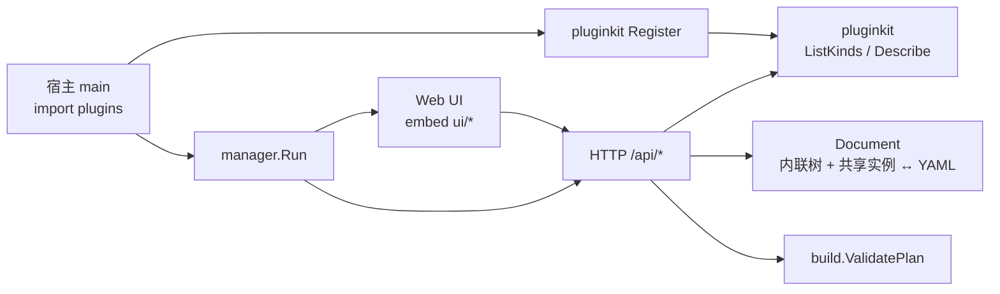
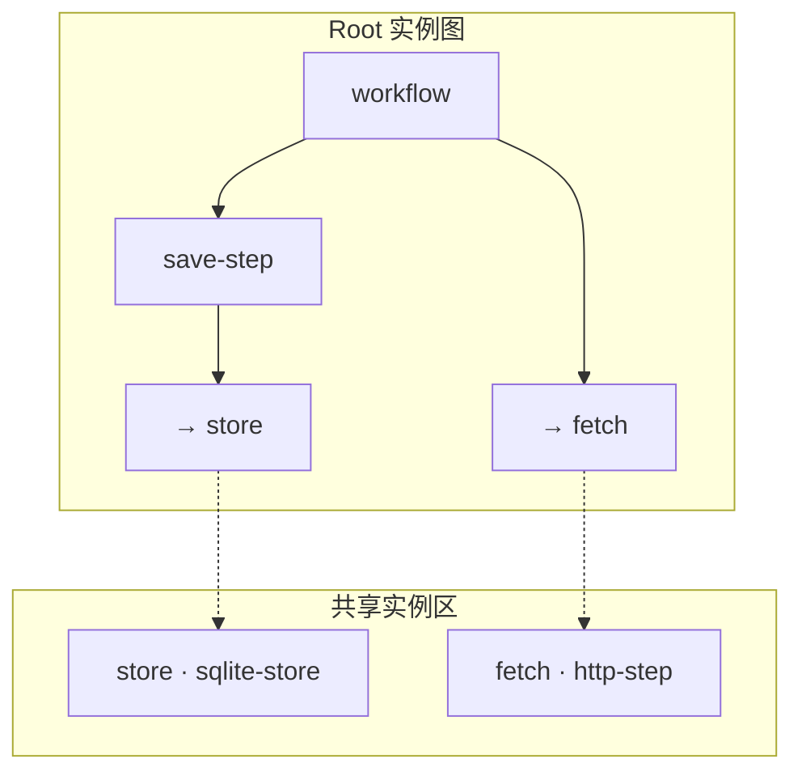

# pluginkit Web Manager

**日期：** 2026-08-21  
**状态：** 已实现（MVP）  
**路径：** `github.com/lengzhao/pluginkit/manager`

## 目标

提供一个可嵌入宿主 binary 的 Web UI，用于查看已注册插件、浏览扩展点，可视化编辑 root 实例图（内联 deps + 顶层共享实例引用），导出 YAML 配置。

## 使用方式

宿主在 main 中 import 自己的插件包（触发 `init` Register），再启动 manager：

```go
package main

import (
    "github.com/lengzhao/pluginkit/manager"
    _ "myapp/plugins"
)

func main() {
    manager.Run(manager.Options{Addr: ":8080"})
}
```

需要完整 `build.Build` 校验时，传入 `ValidateBuild`：

```go
manager.Run(manager.Options{
    Addr: ":8080",
    ValidateBuild: func(ctx context.Context, doc manager.Document) error {
        _, _, err := build.Build[MyRoot](ctx, doc.ToGraph(), doc.RootID)
        return err
    },
})
```

也可只挂载 Handler：

```go
handler, err := manager.New(manager.Options{})
http.ListenAndServe(":8080", handler)
```

`examples/manager` 是内置 demo，注册了 agent/workflow 示例插件。

## 约束

1. manager 读取当前进程注册表，不支持运行时加载未编译插件。
2. 支持 **root 内联树 + 顶层共享实例 + deps 引用**；导出格式与 `build.Build` root 模式一致。
3. Root 由 UI 输入/选择：`rootId` + root `kind`。
4. 共享实例在 UI 独立区域维护，deps 可引用已有实例 id（字符串）或内联插件对象。

## 架构



## HTTP API

| 方法 | 路径 | 说明 |
|---|---|---|
| GET | `/api/catalog` | 所有已注册 kind 及 config/extensions 元数据 |
| GET | `/api/describe/{kind}` | 单个 kind 元数据 |
| GET | `/api/compatible?parent=&ext=` | 扩展点候选插件 |
| POST | `/api/template/{kind}` | 返回 `Describe().Template()` |
| POST | `/api/export` | Document → YAML |
| POST | `/api/import` | YAML → Document（自动识别 root 与共享实例） |
| POST | `/api/validate` | 结构 + ValidatePlan + 可选 ValidateBuild |

Document JSON：

```json
{
  "rootId": "workflow",
  "plugin": {
    "use": "workflow",
    "config": {},
    "deps": {
      "steps": ["fetch", { "use": "save-step", "deps": { "store": "store" } }]
    }
  },
  "shared": {
    "fetch": { "use": "http-step", "config": {}, "deps": {} },
    "store": { "use": "sqlite-store", "config": { "path": "/tmp/db" }, "deps": {} }
  }
}
```

导出 YAML 示例：

```yaml
workflow:
  use: workflow
  deps:
    steps:
      - fetch
      - use: save-step
        deps:
          store: store
fetch:
  use: http-step
store:
  use: sqlite-store
  config:
    path: /tmp/db
```

## UI 交互

- 顶部：Root ID、Root Kind、新建 / 校验 / 导入 / 导出
- **共享实例区**：添加顶层共享实例（实例 id + kind），可编辑 config 与 deps；被引用时显示引用计数，有引用时不可删除
- **Root 实例图**：支持「树状 / 扁平」一键切换；树状为嵌套 deps，扁平为按 path 展开的卡片列表
- 切换到树状视图（或树状模式下导入 YAML）时，**仅被引用一次的共享实例**会自动内联到引用处并移出 shared；多处引用的共享实例保持不变
- **共享实例区**：始终扁平展示在左侧边栏，不受 Root 视图切换影响
- 引用节点显示 `→ instance-id`，可跳转至共享实例或解除引用
- 双击节点或点击 `config`：编辑插件 config
- 右侧：YAML 预览（随编辑更新）



## Demo 启动

```bash
go run ./examples/manager
# http://localhost:8080
```

## 后续

- 画布拖拽布局（React Flow）
- 内联实例一键提升为共享实例
- 由宿主声明多个 root 目标类型
