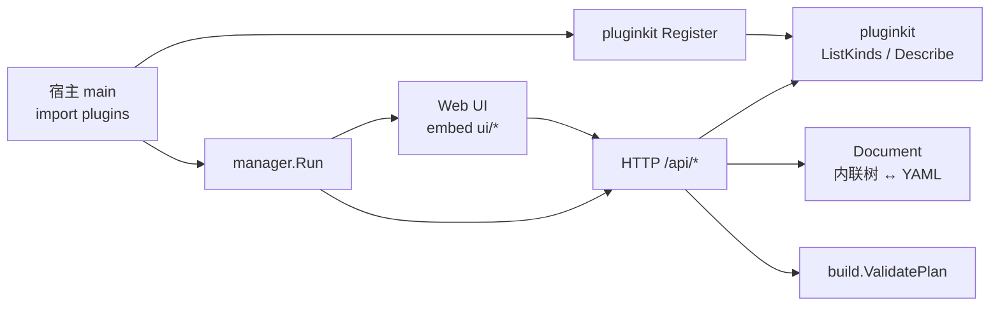

# pluginkit Web Manager

**日期：** 2026-08-21  
**状态：** 已实现（MVP）  
**路径：** `github.com/lengzhao/pluginkit/manager`

## 目标

提供一个可嵌入宿主 binary 的 Web UI，用于查看已注册插件、浏览扩展点，并以**内联 deps** 方式可视化编辑 root 实例图，导出 YAML 配置。

## 使用方式

宿主在 main 中 import 自己的插件包（触发 `init` Register），再启动 manager：

```go
package main

import (
    "github.com/lengzhao/pluginkit/manager"
    _ "myapp/plugins"
)

func main() {
    manager.Run(manager.Options{Addr: ":8080"})
}
```

需要完整 `build.Build` 校验时，传入 `ValidateBuild`：

```go
manager.Run(manager.Options{
    Addr: ":8080",
    ValidateBuild: func(ctx context.Context, doc manager.Document) error {
        _, _, err := build.Build[MyRoot](ctx, doc.ToGraph(), doc.RootID)
        return err
    },
})
```

也可只挂载 Handler：

```go
handler, err := manager.New(manager.Options{})
http.ListenAndServe(":8080", handler)
```

`examples/manager` 是内置 demo，注册了 agent/workflow 示例插件。

## 约束

1. manager 读取当前进程注册表，不支持运行时加载未编译插件。
2. 第一版只支持**单个 top-level root id** 的内联配置，不支持顶层引用共享实例。
3. Root 由 UI 输入/选择：`rootId` + root `kind`。
4. 导出格式与 `build.Build` root 模式一致。

## 架构



## HTTP API

| 方法 | 路径 | 说明 |
|---|---|---|
| GET | `/api/catalog` | 所有已注册 kind 及 config/extensions 元数据 |
| GET | `/api/describe/{kind}` | 单个 kind 元数据 |
| GET | `/api/compatible?parent=&ext=` | 扩展点候选插件 |
| POST | `/api/template/{kind}` | 返回 `Describe().Template()` |
| POST | `/api/export` | Document → YAML |
| POST | `/api/import` | YAML → Document（仅单 root 内联） |
| POST | `/api/validate` | 结构 + ValidatePlan + 可选 ValidateBuild |

Document JSON：

```json
{
  "rootId": "agent",
  "plugin": {
    "use": "agent",
    "config": {},
    "deps": {
      "llm": { "use": "openai", "config": { "model": "gpt-5.5" } },
      "tools": [
        { "use": "read-file", "config": { "root": "." } },
        { "use": "shell" }
      ]
    }
  }
}
```

## UI 交互

- 顶部：Root ID、Root Kind、新建 / 校验 / 导入 / 导出
- 中间：树形实例图；扩展点显示 `+`，点击列出 `CompatibleKinds`
- 双击节点或点击 `config`：编辑插件 config
- 右侧：YAML 预览（随编辑更新）

## Demo 启动

```bash
go run ./examples/manager
# http://localhost:8080
```

## 后续

- 画布拖拽布局（React Flow）
- 顶层共享实例（引用模式）
- 由宿主声明多个 root 目标类型
