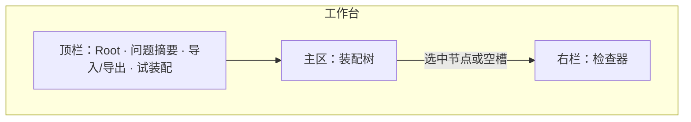
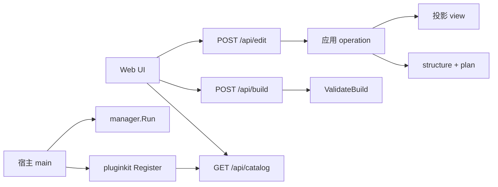
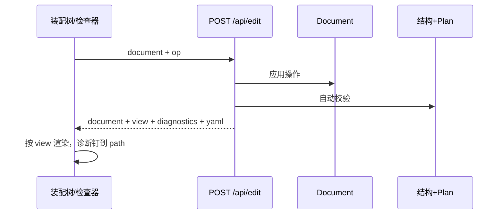

# pluginkit Web Manager

**日期：** 2026-08-22  
**状态：** 已实现  
**路径：** `github.com/lengzhao/pluginkit/manager`

## 目标

提供一个可嵌入宿主 binary 的 Web 工作台：从当前进程注册表装配 root 实例图，导出与 `build.Build` 兼容的 YAML。

同一工作台有两种入口：空白新建、导入已有 YAML。主交互是填槽装配。共享实例是动作（提取为共享），不是常驻分区。右侧是检查器，不是 YAML 编辑器。

## 使用方式

宿主在 main 中 import 自己的插件包（触发 `init` Register），再启动 manager：

```go
package main

import (
    "github.com/lengzhao/pluginkit/manager"
    _ "myapp/plugins"
)

func main() {
    manager.Run(manager.Options{Addr: ":8080"})
}
```

需要完整 `build.Build` 校验时，传入 `ValidateBuild`：

```go
manager.Run(manager.Options{
    Addr: ":8080",
    ValidateBuild: func(ctx context.Context, doc manager.Document) error {
        _, _, err := build.Build[MyRoot](ctx, doc.ToGraph(), doc.RootID)
        return err
    },
})
```

也可只挂载 Handler：

```go
handler, err := manager.New(manager.Options{})
http.ListenAndServe(":8080", handler)
```

`examples/manager` 是内置 demo，注册了 agent/workflow 示例插件。

## 约束

1. manager 读取当前进程注册表，不支持运行时加载未编译插件。
2. 导出格式与 `build.Build` root 模式一致：root 内联树 + 顶层共享实例 + deps 引用。
3. 无服务端会话：浏览器持有 `Document`，每次编辑把文档和操作一起交给后端。
4. `ValidateBuild` 会调用插件 `New`，只在用户点「试装配」时执行。

## 产品原则

- 用户操作的是装配树：选插件、填配置、补空槽。YAML 是导入/导出产物。
- 前端不解析 `deps` 的联合类型，不实现提取/解除共享。图语义在后端。
- 视图不改变文档。不提供树状/扁平切换。

## 信息架构

单一工作台：



**顶栏：** Root id、Root kind、问题条数、导入、导出、试装配。换 kind 或新建时，若文档非空则先确认。

**主区：** 唯一结构视图。插件卡片展示 kind；共享引用显示 `→ id` 芯片。必填空槽醒目；可选槽默认收起，点添加后展开。无左侧插件目录、无共享实例侧栏、无常驻 YAML 列。

**检查器：**

| 选中 | 内容 |
|---|---|
| 无选中 / Root 概览 | 缺哪些必填槽、有哪些共享名、结构校验总览 |
| 插件节点 | kind 说明、config 表单、依赖列表、该节点诊断 |
| 空槽 | 兼容 kind + 类型匹配的已有共享实例 |
| 引用芯片 | 指向谁、跳到定义、解除引用 |

插件目录只出现在空槽候选里。点击候选不会毁掉当前文档。

YAML：导入用对话框；导出复制/下载；检查器底部可折叠只读预览。

共享实例的子树不进主树。主树在引用芯片上高亮；选中 `shared.<id>` 时，检查器内嵌该实例自己的槽位。

## 关键交互

每次改文档都走 `document + operation → document + view + diagnostics`。

**填槽：** 点空槽 → 检查器列出兼容 kind，以及可引用的共享实例。选 kind 插入内联节点并选中它；选引用则写入 `→ id`。单值槽填满后改为「替换」；列表槽可继续追加。

**配置：** 选中节点后按字段元数据出表单，防抖提交 `setConfig`。无 config 的插件不显示空表单。

**提取为共享：** 仅内联节点（非 root、非引用）。用户指定实例 id，该位置变成引用芯片，定义写入 `shared`。已是引用的节点不能再提取。

**解除引用：** 单值槽变空槽。若该共享已无引用，默认删除定义，避免孤儿实例。

**校验：** 每次 edit 自动跑 structure + plan。诊断带稳定 path，钉在树节点和检查器上。缺必填槽时空槽本身标红。顶栏显示问题数，点击跳到第一处。试装配走独立接口，结果同样钉到节点。

**导入：** 整树替换，选中 Root 概览。导出不改文档。

## 文档模型

UI 与 API 共用的存储形状不变，导出 YAML 与 `build.Build` 兼容：

```json
{
  "rootId": "workflow",
  "plugin": {
    "use": "sequential-workflow",
    "config": {},
    "deps": {
      "steps": ["fetch", { "use": "save-step", "deps": { "store": "store" } }]
    }
  },
  "shared": {
    "fetch": { "use": "http-step", "config": {}, "deps": {} },
    "store": { "use": "sqlite-store", "config": { "path": "/tmp/db" }, "deps": {} }
  }
}
```

`shared` 是存储细节，不是界面分区。新建 root 时 `deps` 为空对象，必填槽以空槽 + `missing_dep` 诊断出现，不写入 `use: ""` 占位。

稳定 path：

| path | 含义 |
|---|---|
| `root` | root 插件节点 |
| `root.deps.llm` | 单值依赖（节点、引用或空槽） |
| `root.deps.tools[0]` | 列表项 |
| `shared.store` | 共享实例定义 |
| `shared.store.deps.x` | 共享实例上的依赖 |

## 架构





## HTTP API

| 方法 | 路径 | 说明 |
|---|---|---|
| GET | `/api/catalog` | 已注册 kind 及 config/extensions 元数据，供顶栏选 Root |
| POST | `/api/edit` | 应用操作并返回投影与 structure/plan 诊断 |
| POST | `/api/build` | 不改文档；在 structure+plan 通过后跑 `ValidateBuild` |

兼容列表、模板、空槽候选由 `view` 带回，前端不再调用 `/compatible`、`/template`。导入是 `importYAML` 操作；YAML 文本在 edit 响应里。旧的 `/api/describe`、`/api/compatible`、`/api/template/{kind}`、`/api/export`、`/api/import`、`/api/validate` 删除。

### POST /api/edit

请求：

```json
{
  "document": { "rootId": "agent", "plugin": { "use": "agent" }, "shared": {} },
  "op": { "type": "attach", "path": "root.deps.llm", "kind": "openai" }
}
```

响应：

```json
{
  "document": {},
  "view": {},
  "diagnostics": [],
  "yaml": "agent:\n  use: agent\n"
}
```

| `op.type` | 字段 | 作用 |
|---|---|---|
| `validate` | | 只校验，不改文档 |
| `newRoot` | `kind`, `id?` | 按 kind 建空 root；`id` 默认等于 kind |
| `setRootId` | `id` | 改 root id，不得与 shared 冲突 |
| `attach` | `path`, `kind` | 空槽或列表槽插入内联；单值已填则替换 |
| `attachRef` | `path`, `refId` | 写入共享引用；单值已填则替换 |
| `remove` | `path`, `deleteOrphan?` | 删节点或解除引用；孤儿共享默认删除 |
| `setConfig` | `path`, `config` | 写入该节点 config |
| `hoist` | `path`, `id` | 内联节点提取为共享 id |
| `importYAML` | `yaml` | 用 YAML 整表替换 |

非法 op、未知 path、未知 kind、坏 YAML：HTTP 400，文档不变。业务校验失败：HTTP 200，用 `diagnostics` 表达。

### POST /api/build

请求 `{ "document": ... }`。先做 structure + plan；通过后再调用 `ValidateBuild`。响应与 edit 相同形状（`document` 原样返回），额外诊断 `stage: "build"`。未配置 `ValidateBuild` 时，plan 通过即视为装配成功。

### view

前端只渲染 `view`，不解析 `deps` 联合类型。

- `view.root`：装配树根，`role` 为 `inline`。
- `view.shared`：共享定义列表，供跳到定义；不是侧栏数据源。
- 节点 `role`：`inline` | `ref` | `slot` | `shared`。
- 每个节点带 `slots`：空槽含 `kinds` 与可引用 `refs`；已填槽含 `items`（内联子树或引用芯片）。
- 引用节点 `role: ref`，带 `refId`、`kind`、`refCount`。

### diagnostics

```json
{
  "path": "root.deps.llm",
  "severity": "error",
  "stage": "structure | plan | build",
  "code": "missing_dep",
  "message": "需要一个实现 LLM 的插件"
}
```

`code` 至少包括：`missing_dep`、`unknown_kind`、`unknown_ref`、`incompatible`、`invalid_config`、`id_conflict`、`plan`、`build`。

structure 由 manager 按注册表与 deps 形态收集，path 必须能钉到槽或节点。plan 将 `build.ValidatePlan` 的 `*build.Error` 尽量映射到 path（优先实例 id：root / shared / 生成路径）。无法映射时 path 为 `root`，`code` 为 `plan`。

## Demo

```bash
go run ./examples/manager
# http://localhost:8080
```

## 明确不做

- 画布拖拽
- YAML 双向绑定
- 树状/扁平视图，以及切视图改数据
- 常驻插件目录、常驻共享区
- 运行时加载未编译插件
- 服务端会话与配置持久化
