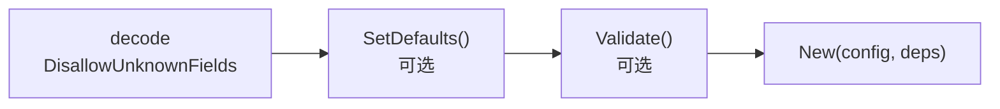

# 配置默认值与校验约定（Defaulter / Validator）

**日期：** 2026-10-02
**状态：** 草案
**目标：** 让插件把散落在 `New()` 里的默认值填充和配置校验收敛为两个可选接口，把配置错误从运行期提前到装配期，并让 decode → defaults → validate 成为一条被 `Build` / `ValidatePlan` / `Template` 三处复用的管线。

## 1. 背景与问题

现状：

- `build` 在 decode 阶段用 `encoding/json` + `DisallowUnknownFields` 做严格解码，未知字段直接报错。
- 插件的默认值填充（`if cfg.X == 0 { cfg.X = 30 }`）和配置校验（apiKey 缺失、枚举非法）散落在各插件的 `New()` 里，错误在 `construct` 阶段才暴露。
- `Describe().Template()` 生成配置骨架时只能填零值占位，不知道真实默认值，manager / scaffold 无法给出可直接使用的配置。
- `ValidatePlan` 只做 resolve / typecheck / deps 规划，不检查 config 内容，编辑器里看到的错误和 `Build` 时的错误不一致。

## 2. 核心约定

根包 `pluginkit` 定义两个可选接口，插件的 Config 类型按需实现：

```go
// Defaulter 填充配置默认值。build 在 decode 之后、Validate 之前调用。
type Defaulter interface{ SetDefaults() }

// Validator 校验配置合法性。build 在 SetDefaults 之后、New 之前调用。
type Validator interface{ Validate() error }
```

- 两个接口都是可选的，不实现则行为与现状完全一致。
- `SetDefaults()` 不返回 error：填充默认值不应失败。
- `Validate()` 返回 error：配置错误要响亮，错误信息由插件自己组织。
- 方法应定义在 Config 的指针接收者上（`SetDefaults` 需要修改字段）；框架对值类型 Config 会自动取地址，插件作者无需关心构造函数的 Config 参数是值还是指针。

装配流程变为：



## 3. 错误阶段

新增阶段 `validate`：

| 阶段 | 含义 |
|---|---|
| `decode` | JSON 解码失败、未知字段 |
| `validate` | `Validate()` 返回 error |
| `construct` | `New` 返回 error |

`SetDefaults()` 不返回 error，不需要独立阶段。错误复用现有 `build.Error`，携带 field / use / id / stage。

## 4. 管线复用

同一条 decode → defaults → validate 管线被三处消费，保证「编辑器里看到的错误」和「Build 时的错误」完全一致：

1. **`Build` / `BuildInto`**：每个实例构造前执行，首错即停（构造有拓扑顺序，继续执行无意义）。
2. **`ValidatePlan`**：在现有规划校验之后，对全图所有实例执行 decode + defaults + validate（不调用 `New`），**聚合所有错误**后一次性返回（`errors.Join`）。manager 编辑场景下一次看到全部配置错误。
3. **`Template()`**：生成配置骨架时，先实例化零值 Config 并调用 `SetDefaults()`，模板里填的是**真实默认值**而非零值占位。行为式默认值由此变成可内省的数据，不需要引入 struct tag 或独立 schema 体系。

## 5. 为什么 Validate 不能由 New 替代

单看 `Build` 路径，`Validate()` 是冗余的：`New()` 返回 error 同样会在装配期响亮失败（`construct` 阶段）。`Validate()` 存在的唯一理由是**不构造实例的校验路径**：

- `New` 可能有副作用（建连接、起 goroutine、占端口），manager 编辑器无法每次编辑都调用 `New`；`Validate()` 把「纯数据校验」从「有副作用的构造」中分离出来，使编辑器实时校验和 `ValidatePlan` 预检成为可能。
- 推论约束：`SetDefaults` / `Validate` 必须是纯函数，不访问外部系统；凡是需要外部状态才能判断的校验，仍属于 `New`。

如果未来 manager / 预检路径被废弃，`Validator` 可以安全移除，`Defaulter` 单独成立。

## 6. 已知取舍

- **显式零值与未填无法区分**：JSON decode 后 `timeout: 0` 和没写 `timeout` 都是零值，`SetDefaults` 会覆盖用户显式写的 0。约定：**零值视为未配置**。需要区分时插件可自行使用指针字段（如 `*int`），框架不做额外处理。
- **bool 字段的默认值陷阱**：基于同一约定，bool 字段不要用 `SetDefaults` 设 `true` 默认值——用户显式关闭（`false`）与未填同为零值，会被默认值覆盖，导致开关永远无法关闭。需要默认开启的开关请使用 `*bool`（`nil` 表示未填）。
- **钩子 panic 会传播**：`SetDefaults` / `Validate` 是插件代码，`Build` / `ValidatePlan` / `Describe` 路径均不做 recover；插件作者必须保证其为不 panic 的纯函数。
- **`Validate() error` 装不下结构化错误**（字段级、可渲染的错误列表）。等 manager 需要表单级校验展示时，再演进到 schema-as-data 方案，届时本约定的接口保持兼容。
- **不引入 struct tag 校验**（`default:"30" validate:"required"`）：tag 字符串无法表达跨字段校验和条件默认值，错误信息差，与严格 decode 的哲学不匹配。

## 7. 不做什么

- 不做 schema-as-data（插件返回结构化 ConfigSpec 驱动 UI 表单渲染），记入 backlog。
- 不改动 `config` 包：defaults / validate 发生在 decode 之后，属于 `build` 的职责。
- `SetDefaults` / `Validate` 不接收 ctx，不访问外部系统，与 `init()` 同级纯函数约束。
- 无 Config 的插件（`ConfigType == nil`）不触发任何钩子。

## 8. API 变更

根包 `pluginkit` 新增：

```go
type Defaulter interface{ SetDefaults() }
type Validator interface{ Validate() error }
```

`build` 包：

- `Stage` 新增 `StageValidate`。
- `ValidatePlan` 行为扩展：规划校验通过后，对全图实例执行 decode → defaults → validate，聚合错误返回。

`PluginDescription.Template()` 行为变更：Config 实现 `Defaulter` 时，`config` 字段填真实默认值；未实现时保持零值占位。
