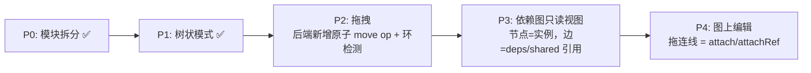

# Manager UI 多视图模式与模块化拆分

**日期：** 2026-10-02
**状态：** P0/P1 已实现（拆分 + 树状模式）；P2 拖拽、P3/P4 依赖图见路线图
**路径：** `github.com/lengzhao/pluginkit/manager/ui`

## 1. 背景

`app.js` 单文件增长到 1100+ 行，且需求扩展到多种画布模式（列表 / 树状 / 未来的依赖图）。本次做两件事：

1. **P0：模块化拆分**——保持无构建步骤，用原生 ES modules 拆分。
2. **P1：树状模式**——纯前端的新画布渲染器，零后端改动。

本文档同时修订 `2026-08-21-web-manager.md` 的「明确不做」：移除「树状/扁平视图」。「画布拖拽」仍在不做清单中，待 P2 实施时移除。

## 2. 核心原则（不变）

- **视图不改变文档**：所有画布模式渲染同一份后端 `view` 投影，文档模型不变。
- **视图不改变选中态**：`selectedPath` 是各视图间的通用语言，切模式不丢选中、不丢检查器内容。
- **诊断钉 path**：错误徽标在任何模式下都按 path 聚合展示。

## 3. 模块结构

```
manager/ui/
  index.html      # <script type="module" src="app.js">
  app.js          # 入口：import 各模块、顶栏事件绑定、boot
  core.js         # state、/api 调用、edit 循环、render 调度、实例导航、通用工具
  inspector.js    # 右栏检查器（三种模式共用）
  views/list.js   # 列表模式（原嵌套卡片）
  views/tree.js   # 树状模式
  style.css
```

两个注册点解耦模块间依赖：

```js
// views/* 自注册画布模式，core 调度时不 import 具体视图
registerCanvasMode(name, { label, renderAssembly(body), renderInstance(body, node) });

// inspector 自注册渲染器，避免 core ↔ inspector 循环 import
registerInspectorRenderer(renderFn, refreshFn);
```

新增画布模式 = 在 `views/` 加一个文件 + 在 `app.js` import 它，core 与现有视图零改动。

## 4. 模式切换

画布顶部的 `.canvas-toolbar` 按注册顺序渲染模式按钮，选中模式持久化到 `localStorage`（`pluginkit:canvasMode`），默认 `list`。

## 5. 树状模式语义

- 行类型：插件节点（kind + path）、槽位（名称 + 类型元信息，空槽标「未配置」）、引用（`→ id` 行）。
- **折叠**：有子节点的行带折叠开关；折叠状态按 path 存 `localStorage`（`pluginkit:treeCollapsed`），是纯 UI 态。
- **折叠时聚合可见性**：折叠的行显示子树错误徽标（`!`）与空槽计数（`N 空槽`），问题不因折叠而消失。
- **共享引用就地展开**：引用行可展开被引实例的 deps 子树（展开状态存 `pluginkit:treeRefExpanded`）。展开的行内节点使用被引实例的真实 path（`shared.<id>.*`），选中、检查器、诊断直接生效。`refChain` 记录祖先引用链，循环引用（A → B → A）禁止展开并标注「循环引用」。
- **选中路径自动展开**：选中路径位于折叠子树或未展开引用内时，渲染时自动展开祖先，保证「返回」/诊断跳转后目标可见。
- 实例画布（选中 `shared.<id>`）在树状模式下渲染该实例的完整 deps 子树，而非列表模式的单层槽位。

## 5.1 选择历史与返回

core 维护选中路径历史栈（上限 100 条，纯 UI 态）：`selectPath` 切换时压栈，画布工具栏的「← 返回」弹出上一位置。文档整表替换（导入 YAML）时清空历史，避免返回到旧文档的 path。

## 6. 路线图



- **P2 拖拽**：手势映射到 op 词汇表。移动节点不能用 `remove`+`attach` 组合（列表槽 path 含下标，remove 后下标位移），需要后端新增原子 `move` op，并做环检测（节点不能移入自己的子树；shared 引用防循环）。前端用原生 HTML5 DnD，不引库。
- **P3 依赖图**：语义为**静态依赖图**（pluginkit 不知道运行时数据流）。增量价值是让 shared 交叉引用可见。一期只读（pan/zoom、点击联动检查器），二期才做图上编辑。保持零依赖则 SVG 自绘。
