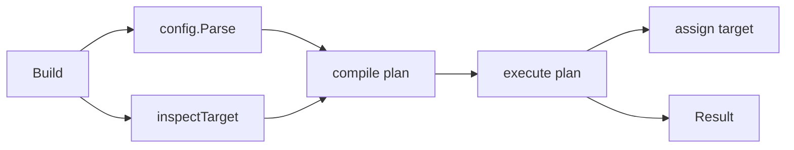

# Build Plan Executor Implementation Plan

> **For Claude:** REQUIRED SUB-SKILL: Use superpowers:executing-plans to implement this plan task-by-task.

**Goal:** Refactor `build` into an internal plan compilation and execution pipeline, with root-id `Build[T]` as the default API and `BuildInto` for target struct assembly.

**Architecture:** `Build[T]` builds a typed root instance from an instance graph and root id. `BuildInto` parses target struct config, compiles a deterministic plan, executes constructors in dependency order, and assigns results back to the target. `plan` and executor details stay unexported in the `build` package.

**Tech Stack:** Go, `testing`, `encoding/json`, reflection, existing `pluginkit` and `config` packages.

---

### Task 1: Document The Revised Build Model

**Files:**
- Modify: `docs/2026-08-20-minimal-plugin-module-design.md`

**Step 1: Update design text**

Clarify that `Plan` and `Executor` are internal implementation concepts. The user-facing API remains:

```go
func Build[T any](ctx context.Context, graph map[string]any, rootID string) (T, *Result, error)

func BuildInto(ctx context.Context, plugins map[string]any, target any) (*Result, error)
```

**Step 2: Document internal phases**

Document this sequence:



### Task 2: Add Red Tests For Internal Plan Boundaries

**Files:**
- Modify: `build/build_test.go`

**Step 1: Write failing tests**

Add tests that describe the intended internal behavior through package-level unexported functions:

```go
func TestCompilePlanDoesNotCallConstructor(t *testing.T)
func TestCompilePlanRejectsDuplicateIDs(t *testing.T)
func TestExecutePlanPreservesTargetSliceOrder(t *testing.T)
```

**Step 2: Run focused tests**

Run:

```bash
go test ./build -run 'TestCompilePlan|TestExecutePlan' -count=1
```

Expected: fail because `compilePlan` and `executePlan` do not exist yet.

### Task 3: Introduce Internal Plan Types

**Files:**
- Create: `build/plan.go`
- Modify: `build/graph.go`
- Modify: `build/build.go`

**Step 1: Create internal plan model**

Add unexported types:

```go
type plan struct {
	steps    []*node
	bindings []binding
}

type binding struct {
	target targetField
	uses   []config.PluginUse
}
```

**Step 2: Move planning logic**

Replace `planNodes` with `compilePlan(parsed, fields)`. It should:

- Match config fields to target fields.
- Validate list vs single shape.
- Lookup plugin specs.
- Run static return type checks.
- Reject duplicate instance IDs.
- Validate required target fields.
- Produce target bindings for assignment.
- Call `topoSort` only after all nodes are known.

### Task 4: Introduce Internal Executor

**Files:**
- Create: `build/execute.go`
- Modify: `build/build.go`

**Step 1: Move execution logic**

Add `executePlan(ctx, p *plan) (*execution, error)` where `execution` contains:

```go
type execution struct {
	instances map[string]any
	result    *Result
}
```

**Step 2: Keep constructor behavior unchanged**

`executePlan` must still:

- Check `ctx.Err()` before each constructor.
- Decode config with unknown fields rejected.
- Inject deps before calling the dependent constructor.
- Avoid calling constructors after static/deps type failures.
- Append `Result.Instances` in construction order.

### Task 5: Move Target Assignment Behind Bindings

**Files:**
- Modify: `build/build.go`
- Optional Create: `build/assign.go`

**Step 1: Replace parsed-field assignment**

Change target assignment to use `plan.bindings`, not raw `parsed` fields. This removes duplicated lookup by field name after planning.

**Step 2: Preserve current behavior**

- Missing optional fields stay untouched.
- Missing slice fields become empty slices.
- Slice fields are assigned in config order, not construction order.
- Type errors remain `StageTypeCheck`.

### Task 6: Verify And Clean Up

**Files:**
- All changed Go files.

**Step 1: Run package tests**

Run:

```bash
go test ./...
```

**Step 2: Run lints**

Use IDE diagnostics on changed files and fix introduced issues.

**Step 3: Remove dead code**

Remove `fieldByJSON` if it remains unused after refactor.
